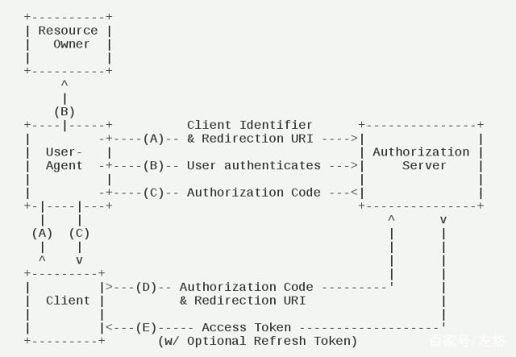
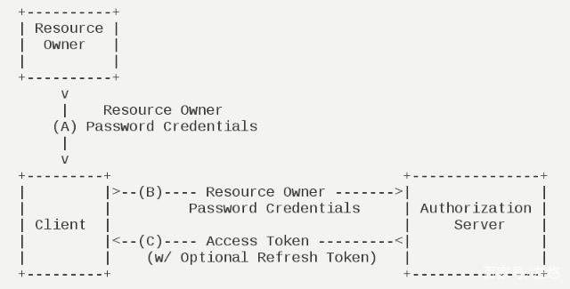

# OAuth2

参考：  
[OAuth 2.0](https://oauth.net/2/)

## OAuth2简介

`OAuth2`（开放授权）是一个开放标准，允许用户(比如`QQ`用户)授权第三方应用(比如某个网课应用)访问他们存储在另外的服务提供者（腾讯QQ用户服务）上的信息。

`OAuth2` 可以用于实现`SSO`。

协议实现`Java Library`：

[spring-security-oauth2](https://mvnrepository.com/artifact/org.springframework.security.oauth/spring-security-oauth2)

[google-auth-library-oauth2-http](https://mvnrepository.com/artifact/com.google.auth/google-auth-library-oauth2-http) [google-oauth-client](https://mvnrepository.com/artifact/com.google.oauth-client/google-oauth-client)

 [oauth2-oidc-sdk](https://mvnrepository.com/artifact/com.nimbusds/oauth2-oidc-sdk)

 [org.apache.oltu.oauth2.client](https://mvnrepository.com/artifact/org.apache.oltu.oauth2/org.apache.oltu.oauth2.client) （2016年就停止更新了）

与`Spring Security`和`Shiro`的关系：`OAuth2`只是一种第三方认证授权的协议，而`Spring Security`和`Shiro`是认证授权与权限管理的框架，可以整合`OAuth2`、`JWT`等协议。

> 资源服务器（resource-server）：提供用户信息资源(姓名、年龄等信息)的服务 
> 资源所有者（resource-owner）：用户 
> 认证服务器（authorization-server）：对用户认证的服务 
> 第三方应用：资源请求者
> 用户代理（user-agent）：浏览器

### OAuth2 的工作流程

一次`OAuth`授权涵盖了三个角色:普通用户(`consumer`)、第三方应用(`ISV`)、平台商(`platform`)。

`OAuth`对`ISV`授权数据访问过程包含了如下几个步骤（授权码模式）:

1. 用户对`ISV`的应用进行访问,发起请求。
2. `ISV`收到请求后,向平台商请求`request token`,并带上其申请的`appId`。
3. 平台将返回给第三方应用`request token`。
4. `ISV`应用将用户引导到平台授权页面,带上自己的`appId`、`request token`以及回调地址。
5. 用户在平台的页面上进行登录,并且完成授权。
6. 平台通过`ISV`提供的回调链接,返回给`ISV`应用`access token`。
7. `ISV`应用通过`access token`取到用户授权的数据,进行加工后返回给用户,授权数据访问完成。

### OAuth2 的四种授权模式

以QQ用户登录新浪微博为例：

#### 授权码模式（authorization code）

这里client应该是新浪微博服务器，user-agent 是浏览器。

A）用户使用浏览器打开新浪微博登录页面，用户点击QQ登录图标，新浪微博向 QQ认证服务器 发送登录请求，
    QQ认证服务器返回QQ网页登录重定向地址；  
B）新浪微博将显示QQ网页登录页，用户输入用户名密码，点击授权登录，前往QQ认证服务器认证用户名密码；  
C）认证成功返回一个授权码新浪微博获取授权码；  
D）使用授权码和重定向地址请求QQ认证服务器；  
E）QQ认证服务器返回访问token和更新token（用于在访问token过期后获取新的访问token）；  
F）新浪微博使用访问token请求QQ资源服务器获取用户信息资源；  
G）新浪微博使用QQ用户信息刷新页面，显示用户头像，曾现登录状态。   

除了授权码模式，其他都有使用范围限制。  
安全级别: 授权码最高、客户端模式最低、简化模式和密码模式居中；  
简化模式危险在浏览器或APP，密码模式风险在第三方服务器。  

#### 简化模式（implicit）

好像就是上面提的那个问题说的不安全的模型，但是由添加了个脚本解密AccessToken的过程；
用于提升安全性（虽然浏览器可以拿到包含AccessToken的Fragment,但是没法解密出来，
还要再请求一次获取解密脚本）。

一般简化模式用于没有服务器端的第三方单页面应用，
因为第三方单页面应用没有服务器端（新浪微博后台）无法使用授权码模式。

#### 密码模式（resource owner password credentials）

授权码模式是第三方服务器无法获取用户名和密码，而密码模式是直接将用户名密码给到第三方服务器，
让服务器自行去获取AccessToken。
但是这样会把用户名密码泄漏给第三方服务供应商。

所以密码模式应该适合企业内部不同服务之间的授权。

#### 客户端模式（client credentials）

client向授权服务器发送自己的身份信息，并请求AccessToken
确认client信息无误后，将AccessToken发送给client。

这种模式是最方便但最不安全的模式。因此这就要求我们对client完全的信任，而client本身也是安全的。因此这种模式一般用来提供给我们完全信任的服务器端服务。在这个过程中不需要用户的参与。

## 代码实现

#### OAuth2 Java实现

### Spring Security 整合 OAuth2

关于Spring Security使用OAuth2参考：
[Spring Security Reference](https://docs.spring.io/spring-security/site/docs/5.1.6.RELEASE/reference/htmlsingle)

### Shiro 整合 OAuth2